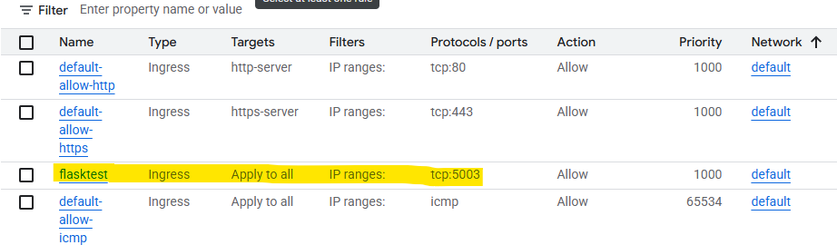
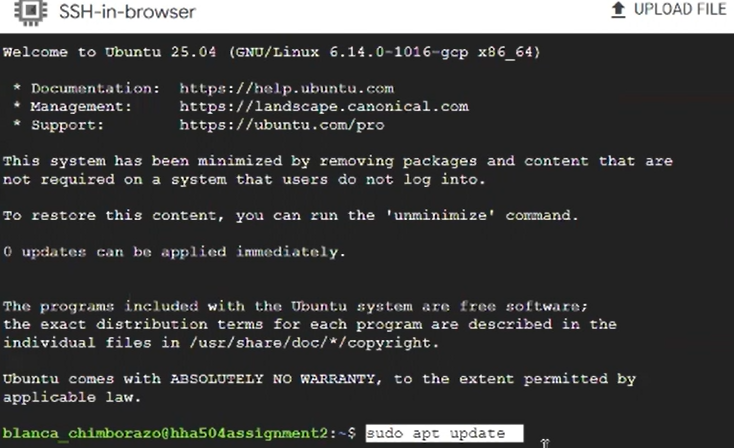

# Deploying a Flask App on GCP
- Name: Blanca Chimborazo-Reyes
- Cloud Provider: GCP
- Link to Video: [screen_recording](https://drive.google.com/file/d/1hh_DLmdJ-Ptm-wDhAnMf2eFoOW2G2DOY/view?usp=sharing)
Used Microsoft ClipChamp to trim video

# Instructions
## Create GitHub Repo
- Generate the code you want to deploy in your Flask app
- The code for this Flask App assignment is in the "app.py" file
- Commit changes

## VM Creation
- Navigate to Google Cloud Platform -> Compute Engine -> VM instances -> Click "Create Instance"
- Configure the following settings:
        - Name: select a name
        - Region: Choose any region
        - Series: E2
        - Machine Type: e2-micro
        - OS and Storage: Change the operating system to Ubuntu
        - Networking: Allow HTTP and HTTPS traffic
- Click "Create"


## Firewall Configuration:
- After your VM is created, navigate to VPC Network -> Firewall -> Click "Create Firewall Rule"
- Configure the following settings:
        - Name: select a name
        - Description: include a short description
        - Targets: all instances in the network
        - Source IPv4 ranges: 0.0.0.0/0
        - Check TCP
        - Ports: 5003
        - Click "Create"

 


## SSH Setup
- Click on the SSH button next to your VM. This will open an SSH terminal and authorize access
- Enter the following commands

```
# Update package lists
    sudo apt update
# Install Git, Python, pip, and venv
    sudo apt install git python3 python3-pip python3-venv -y
# Clone the repository
    git clone https://github.com/bchimborazo/cloud_vm_networking_flask.git (enter your repo's link)
# List files to verify
    ls -l
# Navigate into the project directory
    cd cloud_vm_networking_flask/
# Confirm files
    ls -l
# Create a Python virtual environment
    python3 -m venv venv
# Activate the virtual environment
    source venv/bin/activate
# Install required packages from requirements.txt
    pip install -r requirements.txt
# Start the Flask app 
    python3 app.py (enter name of your file) 
```

 


# Public Access Verification
- Locate your VM's external ID address
- Open a web browser and navigate to: http://<External_IP>:5003
- The Flask app should load successfully
- Public URL: http://34.42.13.78:5003


# Stopping Flask
- In the SSH terminal, press CTRL + C to stop the Flask application. Page should no longer load after refreshing
- Stop or delete your VM


